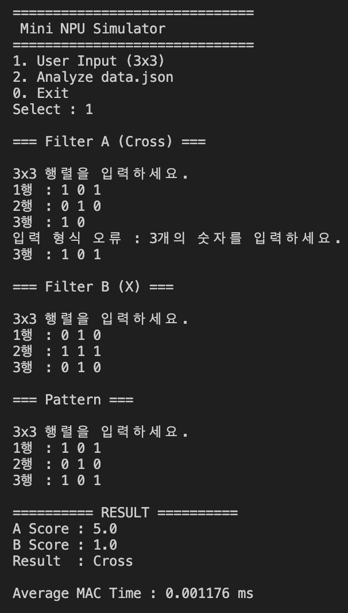
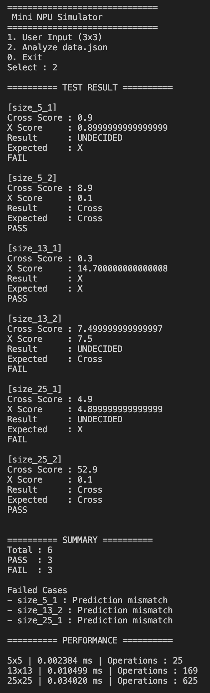

# Mini NPU Simulator

## 프로젝트 소개

Mini NPU Simulator는 AI의 기본 연산인 **MAC(Multiply-Accumulate)** 연산을 직접 구현하여
입력된 패턴이 Cross(+)인지 X인지 판별하는 콘솔 프로그램입니다.

본 프로젝트에서는 Python의 반복문만을 이용하여 MAC 연산을 구현하였으며,
사용자가 직접 3×3 필터를 입력하는 기능과 data.json을 이용한 자동 분석 기능을 제공합니다.

또한 연산 시간을 측정하여 패턴 크기에 따른 성능 변화를 확인하고,
부동소수점 오차를 고려한 epsilon 비교 정책을 적용하였습니다.

---

# 개발 환경

|항목|내용|
|---|---|
|Language|Python 3.12|
|IDE|Visual Studio Code|
|OS|macOS|
|Library|json, time (표준 라이브러리만 사용)|

외부 라이브러리(NumPy, pandas 등)는 사용하지 않았습니다.

---

# 프로젝트 구조

```
mini_npu
│
├── main.py
├── analyzer.py
├── loader.py
├── mac.py
├── matrix.py
├── utils.py
├── data.json
└── README.md
```

### 파일 설명

|파일|역할|
|---|---|
|main.py|메인 메뉴 및 프로그램 실행|
|mac.py|MAC(Multiply-Accumulate) 연산 구현|
|loader.py|data.json 로드 및 스키마 검증|
|matrix.py|행렬 입력 및 출력|
|utils.py|공통 함수(평균, 라벨 정규화, 크기 검사)|
|analyzer.py|성능 측정 및 결과 분석|

---

# 실행 방법

프로그램 실행

```bash
python3 main.py
```

실행 후 메뉴

```
==============================
 Mini NPU Simulator
==============================

1. User Input (3x3)

2. Analyze data.json

0. Exit
```

---

# 구현 내용

## 1. MAC 연산

MAC(Multiply-Accumulate)은 동일한 위치의 값을 곱한 뒤
모든 결과를 더하여 유사도를 계산하는 방식이다.

예를 들어

```
0 1 0
1 1 1
0 1 0
```

와

```
0 1 0
1 1 1
0 1 0
```

을 비교하면

```
0×0
1×1
0×0
1×1
1×1
1×1
0×0
1×1
0×0
```

총합은

```
5
```

가 된다.

프로그램에서는 반복문만 이용하여 구현하였다.

---

## 2. 사용자 입력 모드

사용자가

- Cross Filter
- X Filter
- Pattern

을 직접 입력하여 판정할 수 있다.

입력 오류 발생 시

```
입력 형식 오류
```

메시지를 출력한 뒤 재입력을 요구한다.

---

## 3. JSON 분석 모드

data.json의

- filters
- patterns

를 읽어 자동으로 테스트를 수행한다.

각 테스트마다

- Cross Score
- X Score
- Result
- PASS / FAIL

을 출력한다.

---

## 4. 라벨 정규화

다양한 라벨을 내부 표준 라벨로 변환하였다.

|입력|변환|
|---|---|
|+|Cross|
|cross|Cross|
|Cross|Cross|
|x|X|
|X|X|

이를 통해 데이터 표현 방식이 달라도 동일한 결과를 얻을 수 있다.

---

## 5. epsilon 비교 정책

부동소수점 계산에서는

```
0.9

0.899999999999
```

처럼 미세한 오차가 발생한다.

따라서

```python
abs(score_a-score_b)<1e-9
```

인 경우에는 동일한 점수로 판단하도록 구현하였다.

---

# 주요 기능

- 3×3 사용자 입력
- data.json 자동 분석
- MAC 연산
- PASS / FAIL 판정
- 라벨 정규화
- epsilon 비교
- 성능 측정
- 결과 요약 출력

---

# 실행 결과

## 사용자 입력 모드



Cross 필터와 Pattern이 동일한 경우

```
Cross Score : 5
X Score : 1

Result : Cross
```

가 출력되는 것을 확인하였다.

---

## JSON 분석


모든 데이터를 자동 분석하여

- PASS
- FAIL
- Summary

를 출력한다.

---

## 성능 분석

```
5x5
13x13
25x25
```

필터에 대해 10회 반복 측정 후 평균 시간을 계산하였다.

|Size|Average Time(ms)|Operations|
|---|---:|---:|
|3×3|0.0012|9|
|5×5|0.0033|25|
|13×13|0.0091|169|
|25×25|0.0332|625|

패턴 크기가 증가할수록 연산 시간이 증가하는 것을 확인할 수 있었다.

---

# 결과 리포트

이번 프로젝트에서는 AI에서 사용하는 MAC(Multiply-Accumulate) 연산을 직접 구현하였다.

반복문만을 이용하여 동일 위치의 값을 곱한 후 모두 더하는 방식으로 유사도를 계산하였다.

초기 구현에서는 Cross와 X 라벨이 서로 다른 형식(+, cross, X 등)으로 저장되어 PASS 판정이 실패하는 문제가 발생하였다.

이를 해결하기 위해 normalize_label() 함수를 작성하여 내부 표준 라벨인 Cross와 X로 변환하였다.

또한 실수 계산 과정에서 0.9와 0.899999999999처럼 부동소수점 오차가 발생하였다.

단순 비교를 사용할 경우 동일한 값임에도 다른 값으로 인식하는 문제가 있었다.

이를 해결하기 위해 epsilon(1e-9)을 적용하여 충분히 작은 차이는 같은 값으로 처리하였다.

성능 측정 결과 패턴 크기가 증가할수록 연산 시간이 증가하였다.

5×5보다 25×25에서 더 많은 시간이 소요되었으며 이는 MAC 연산 횟수가 N²에 비례하기 때문이다.

이번 프로젝트를 통해 MAC 연산의 원리와 AI에서 반복 연산이 중요한 이유를 이해할 수 있었다.

---

# 시간 복잡도 분석

MAC 연산은 입력 패턴과 필터를 한 칸씩 모두 방문한다.

행렬의 크기를 N×N이라고 하면

총 연산 횟수는

```
N × N
```

이 된다.

따라서 시간복잡도는

```
O(N²)
```

이다.

실험 결과에서도

3×3

↓

5×5

↓

13×13

↓

25×25

순으로 평균 시간이 증가하였으며
연산 횟수 증가와 동일한 경향을 확인하였다.

---

# 트러블슈팅

## 1. ImportError 발생

### 문제

```
ImportError:
cannot import normalize_label
```

### 원인

utils.py가 저장되지 않아 Python이 빈 파일을 읽고 있었다.

### 해결

파일 저장 후 다시 실행하여 정상적으로 import 되는 것을 확인하였다.

---

## 2. 부동소수점 오차

### 문제

```
0.9

0.89999999999
```

로 인해 동일한 결과가 FAIL 처리되었다.

### 해결

epsilon(1e-9)을 적용하여 작은 오차는 동일한 값으로 처리하였다.

---

# 느낀 점

이번 프로젝트를 통해 AI의 기본 연산인 MAC의 동작 원리를 직접 구현해 볼 수 있었다.

또한 단순한 알고리즘 구현뿐 아니라 입력 검증, JSON 스키마 처리, 예외 처리, 성능 측정, 부동소수점 오차 해결 등 실제 프로그램 개발 과정에서 필요한 요소들을 함께 경험할 수 있었다.